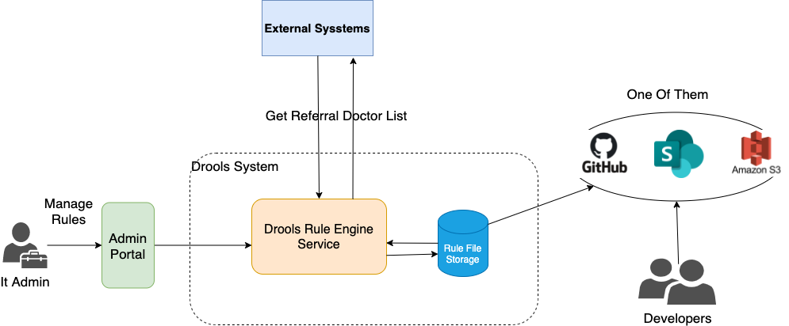
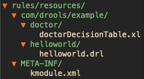
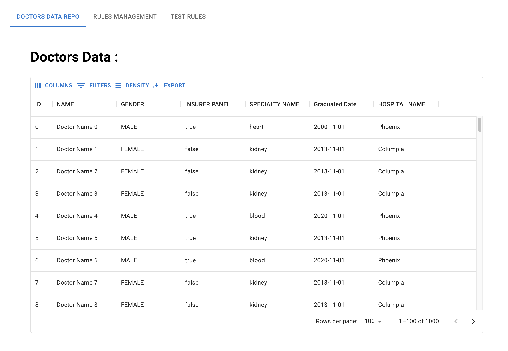
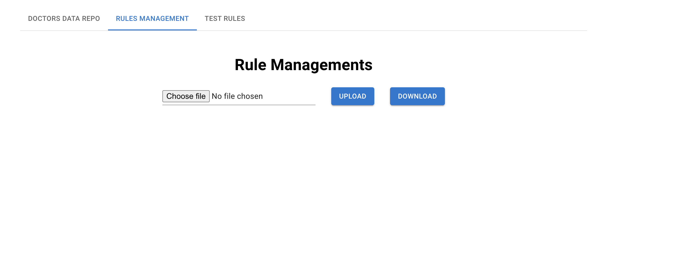
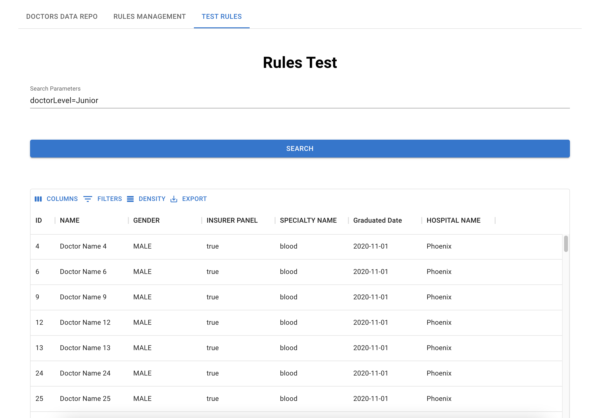

# springboot-drools-example

## Why is there this repo

This repo is an example of using decisions table (drools) in spring boot project.

## Technical Stack

- Java 17
- Spring Boot
- Drools

## Architecture

Demo Architecture

- Admin can upload/download rules file from portal without restart server.
- Front end can trigger the rules via restful api.
- Developers can change rules directly from github or file storeages.

## How to start

- Start backend

  ./mvnw spring-boot:run

- Start Front End

  npm install
  npm start

- Search in "TEST RULES" tab:
  typing: "doctorLevel=Junior" then click search button to see the results.

## Explanation

#### Drools Dependencies

    <dependency>
      <groupId>org.drools</groupId>
      <artifactId>drools-compiler</artifactId>
      <version>${drools.version}</version>
    </dependency>
    <dependency>
      <groupId>org.kie</groupId>
      <artifactId>kie-spring</artifactId>
      <version>${drools.version}</version>
    </dependency>

#### Rules files & Kmodules configuration location

By default, kie-spring will scan and look up kmodules in class path resources.
In maven project, you can place all the rules file and kmodule xml configuration under
src/main/resources folder or you can customize that location as bellow configuration:

    <plugin>
      <groupId>org.springframework.boot</groupId>
      <artifactId>spring-boot-maven-plugin</artifactId>
      <configuration>
        <excludes>
          <exclude>
            <groupId>org.projectlombok</groupId>
            <artifactId>lombok</artifactId>
          </exclude>
        </excludes>
      <directories>
        <directory>${basedir}/rules/resources</directory>
      </directories>
      </configuration>
    </plugin>

change value of "directory" tag for your folder.

#### Rules files folder structure

Rules folder structure

notes: kmodule.xml file must be under folder META-INF

#### Screenshots

Mock Data Screen

 

Rule Management Screen

 

Rule Execution Screen

